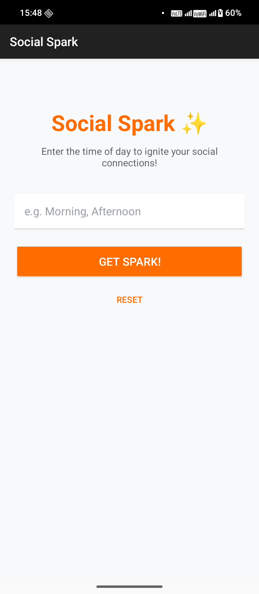
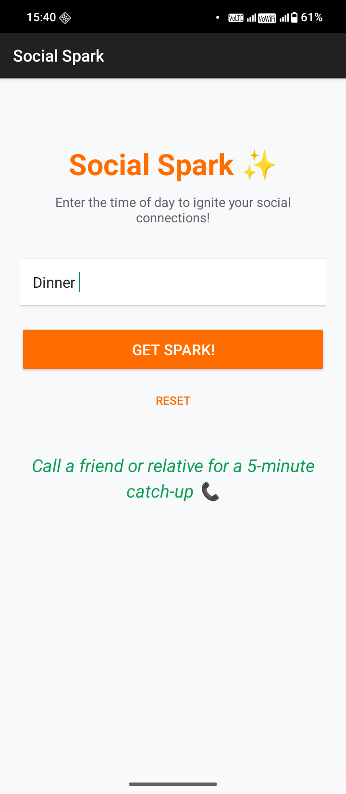
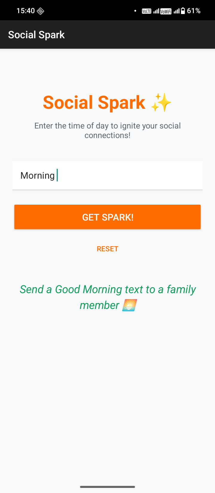

# Social Spark

## App Purpose
The **Social Spark** app helps users stay socially connected by suggesting small actionable social actions ("sparks") based on the time of day. Designed for a daily lifestyle integration, it prompts users like Cora to engage proactively with family, friends, and colleagues at suitable moments across the day. 

## Design Decisions
- **Kotlin & Android Studio**: Built using native Android development patterns for stability and performance.
- **ConstraintLayout**: Using `ConstraintLayout` to keep the UI deeply engaging, responsive, and flat in hierarchy, which adheres to modern Android guidelines.
- **User Interface**: Created with an engaging color palette consisting of warm tones (Orange) for the primary actions and a calming green for the results, along with appropriate text stylings and margins.
- **Input Validation & Error Handling**: Ensures users type a supported time of day, otherwise presenting a motivating and friendly error message.
- **Conditionals**: Per the requirements, we utilized standard `if / else-if` blocks in Kotlin logic processing, avoiding the usage of `when`.
- **Systematic Logging**: Key interactions such as initialization, user button presses, and result states are tracked with `Log.d` making the app easier to troubleshoot.

## GitHub Actions & CI/CD Pipeline
- **Continuous Integration**: Configured in `.github/workflows/build.yml` to automatically listen and trigger builds on every push to the `main` branch. 
- **Automated Builds**: Pulls the code context, sets up JDK 17, and uses Gradle wrapper to run `test` and `assembleDebug`, guaranteeing code integrability.
- **Artifacts**: Uses `actions/upload-artifact` to package the generated debug APK that can be easily retrieved right from the GitHub commit checks page.

## Screenshots

### Initial State

### Morning Spark

### Afternoon Spark

### Dinner Spark

